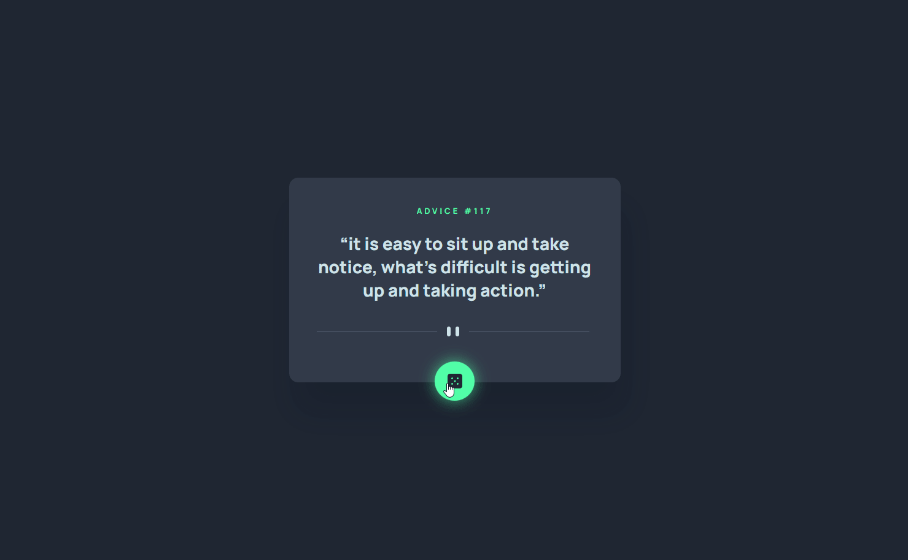

# App Gerador de Conselhos

**Consumindo a API** [Advice Slip JSON API](https://api.adviceslip.com/) ao clicar no botão (🎲), é sorteado um novo conselho e mostrado ao usuário o conselho e seu respectivo id, além do **design** proposto

## Informações adicionais ✍
- [Desafio resolvido do Frondend Mentor](https://www.frontendmentor.io/challenges/advice-generator-app-QdUG-13db/hub)
- Exercício do módulo de JS Avançado do curso [DevQuest](https://devemdobro.com/)


## Minha Resolução 💡



**[Clique aqui](https://amandameneghini.github.io/app-gerador-de-conselhos/) para visualizar**

### Tecnologias Utilizadas 🛠

<div style="display: flex">
    
    
    
</div>

### Extensões Utilizadas 🎨


**Extenção** para auxiliar na criação da responsividade do Chrome Web Store "[Responsive Viewer](https://chromewebstore.google.com/detail/responsive-viewer/inmopeiepgfljkpkidclfgbgbmfcennb)" 


**Extenção** para auxiliar na criação do Design do Chrome Web Store "[Pixel Perfect](https://chromewebstore.google.com/detail/perfectpixel-by-welldonec/dkaagdgjmgdmbnecmcefdhjekcoceebi)" 

## Como utiliza 🤔

1. Crie uma pasta em que deseja clonar o repositório.

2. Com o botão dirteito do mouse selecione a opção "Git Bash HERE"

3. Clone o projeto (no prompt do Git Bash):

```
git clone https://github.com/AmandaMeneghini/app-gerador-de-conselhos.git
```

4. Acesse a pasta do projeto:

```
cd app-gerador-de-conselhos
```

5. Abra o código no VS Code:

```
code .
```

Passos extras com a extensão **Live Server** no **VS Code**:

6. Vá no VS Code em extenções e baixe a extenção "Live Server"

7. Aperte **Alt + L + O**, para a visualização do projeto

